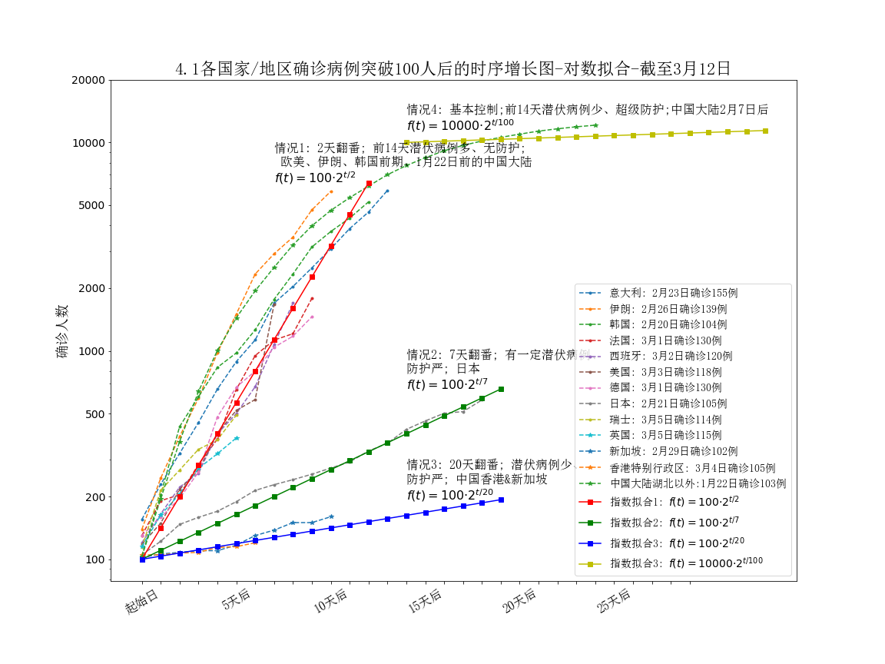
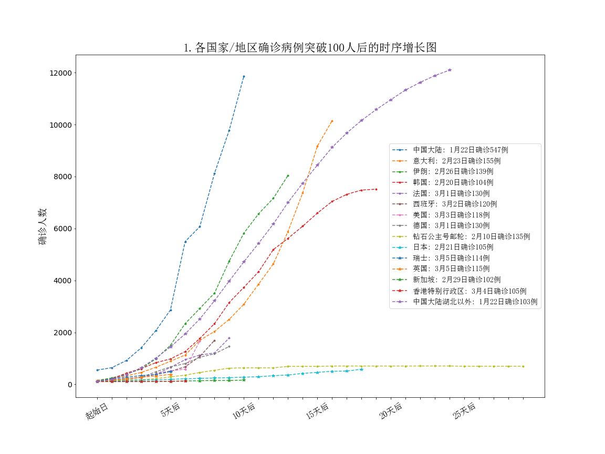
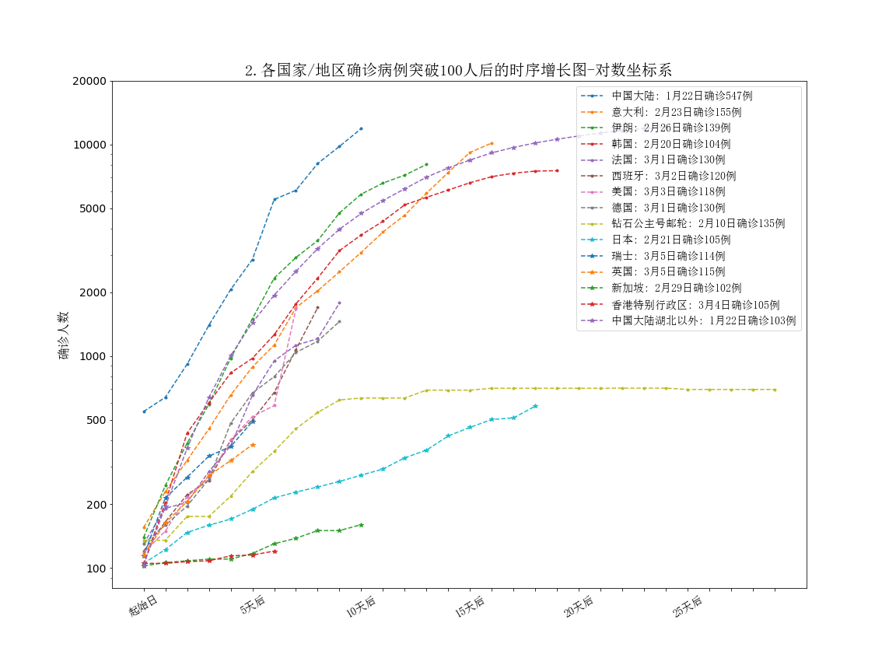
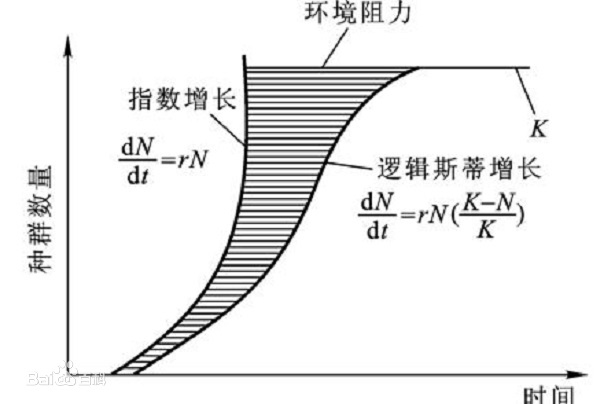
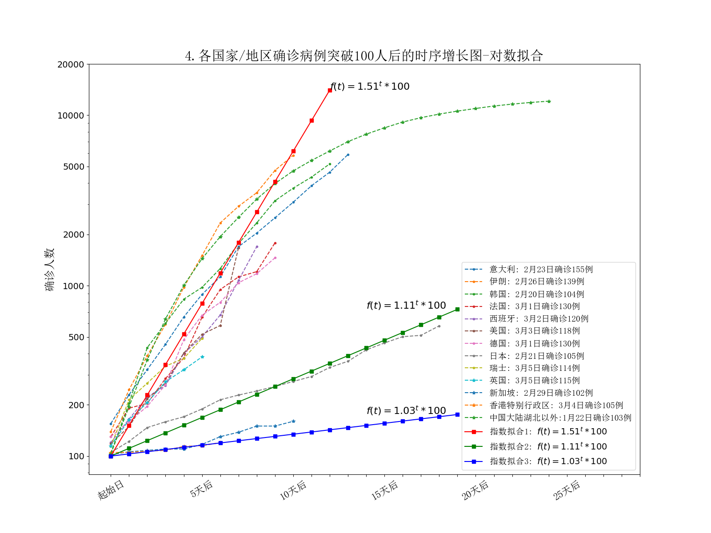

# nconv_global_ana
Anlays of nconv confirmed case number by timeseries in different countries  
# 新冠全球数据分析
本文基于中国CDC和约翰霍普金斯提供的全球新冠数据，对确诊病例数前30的国家/地区的新冠确诊随日期增长情况做了一个挖掘分析。

先放结论图：


    注：
      - 无防护情况下，传染速度很可能是两天翻番
      - 感染后会有一段时间的潜伏期，基本在14天以内
      - #### 当前的确诊情况其实是前14天内积累的潜伏病例的反映
      - 从爆发期增长速度的一致性可以推断新冠没有人种差异

图中增长情况可以分为疯狂爆发、缓慢增长、基本控制3种：     
  
- ### 疯狂爆发：
  基本都是2天翻番。 这些地区的特点是：潜伏病例多，无防护。
  典型是伊朗、欧美、韩国最近半个月和中国大陆早期。  
  注：
  - 当前的确诊情况是前14天内积累的潜伏病例的反映， 即便采取防护确诊数仍然会指数增长
  - 由于我们在1月22日前几乎无隔离和较少防护，且处于春运高峰， 感染速度也是两天翻番
  - 从爆发期增长速度的一致性可以推断新冠没有人种差异
  
- ### 缓慢增长: 
    7天甚至20天翻番。这些地区的特点是：现存病例少，有防护。典型是日本、新加坡和中国香港。    
    注：
    - 这些地区甚至比中国大陆更早做了防护和隔离，因此现存病例少（也不存在大量潜伏），新增缓慢。

- ### 基本控制: 
    几乎无增长。典型是2月7日后中国大陆除湖北以外地区， 以及当前的武汉。
  特点是前14天几乎无潜伏病例。   
  注：
  - 1月23日全国各地开始超级隔离， 到2月7日也就是这14天期间没有新增大数量级的潜伏病例。
  
 整体来说:
- #### 东亚地区会比较稳定
    - 目前看我们已被控制，绝大部分省份保持0增长，其实是过去14天的体现。全社会亦有高度的防护意识。
    - 日本、中国香港和新加坡等地区也可认为已控。     
    这些地区甚至比我们更早开始防护和隔离，现存病例少（潜伏基本被暴露），且民众防护意识较强，一直处于缓慢增长期。
    - 韩国（绿色点虚线）也应该到拐点了，主要是因为半个月前的宗教集会感染了一大批人。   
    但韩国隔离和防护有一定时间了，目前潜伏患者差不多都暴露了，接下来会步入缓慢增长期。   
    大概率这个月底会控制下来，最终确诊数可能与我国除湖北（绿色星点虚线）外相同   
- #### 欧美还在爆发期，极可能各国均会破2万
    由于前14天潜伏病例太多，预计这些国家确诊人数均会超过中国湖北以外地区水平。    
    有一种最糟糕的情况： 
    - 由于欧洲主要国家面积、人口与湖北省接近， 极可能面临医疗资源挤兑的问题；
    - 西方文化普通人没有戴口罩的习惯， 相对于东亚人际交往活动更多，尤其是南欧地区；
    - 因此可能各国感染人数、死亡率可能会超过湖北水平
    - 有可能新冠会被西方国家放弃治疗，作为流行病对待 
 - #### 因此本次新冠全球感染人数几乎可以确定会超过50万。
 

# 数据分析流程：
## 获取数据：
我们采用John Hopkins 整理的全球新冠疫情数据：https://raw.githubusercontent.com/CSSEGISandData/COVID-19/master/csse_covid_19_data/csse_covid_19_time_series/time_series_19-covid-Confirmed.csv    
这个数据是实时更新的
​
### 数据清洗、本地化：
主要是选取疫情最严重的前30个地区，为了方便中文读者， 国家名转化为中文名。
```python
df0 = pd.read_csv('time_series_19-covid-Confirmed.csv')
dates = ['%s月%s日' % (v1[0], v1[1]) for v1 in [v.split('/')[:2] for v in df0.columns[4:]]]
dates = [(df0.columns[4:][i], dates[i]) for i in range(len(dates))]
df0 = df0.rename(columns=dict(dates))
df1 = df0.groupby('Country/Region').sum().reset_index()

top30_cn_str = '''中国大陆 意大利 伊朗 韩国 法国 西班牙 美国 德国 钻石公主号邮轮 日本 瑞士 挪威 英国 荷兰 瑞典 比利时 丹麦 奥地利 新加坡 马来西亚 香港特别行政区 巴林王国 澳大利亚 希腊 加拿大 阿联酋 伊拉克 科威特 冰岛 埃及'''
top30_cn = top30_cn_str.split(' ')
names = ['Mainland China', 'Italy', 'Iran (Islamic Republic of)',
         'Republic of Korea', 'France', 'Spain', 'US', 'Germany', 'Others',
         'Japan', 'Switzerland', 'Norway', 'UK', 'Netherlands', 'Sweden',
         'Belgium', 'Denmark', 'Austria', 'Singapore', 'Malaysia',
         'Hong Kong SAR', 'Bahrain', 'Australia', 'Greece', 'Canada',
         'United Arab Emirates', 'Iraq', 'Kuwait', 'Iceland', 'Egypt']
```

### 数据聚合
数据可视化选取，和模型拟合分析这里略去（具体可查看代码）

## 数据可视化
### 线性坐标系
这是在普通线性坐标系里的各国增长图：


### 对数坐标系

普通坐标系中很难看出关联， 我们试一下对数坐标系，可以挖掘不少insight：


在对数坐标下，隐藏的增长关系被暴露了，每一条曲线前期都是直线，显示很明显的线性回归。
而曲线的斜率就是日增长率。

我们可以看到：

- 在左上方密集曲线， 欧美各国+伊朗的数据都与中国平行。

- 但是也有三组离群曲线：钻石公主号， 日本，新加坡和中国香港。


## 拟合分析
### 模型选取
我采用的是简单的指数拟合 y=a·e^(b·x), 该拟合有效的依据是各传染病模型在初期都可以近似为指数增长(类似于高中生物的种群增长曲线)：
   

图片源自[百度](https://bkimg.cdn.bcebos.com/pic/78310a55b319ebc4f14ae9a08e26cffc1e1716dc?x-bce-process=image/resize,m_lfit,w_268,limit_1/format,f_jpg)

典型的传染病传播数学模型，无论是SI模型还是SIRS、SERI，都类似logistic函数。

此外，历史增长数据在对数坐标系中为直线也证实了我们的结论。

### 指数拟合
我们拟合的结果如下：


### 模型分析
1.51大概等于根号2， 也就是2天翻番，我们决定换一种函数表达形式，也就是开头的图：


#### 增长速度可以分为三大类， 分别对应翻倍天数为2天， 7天， 25天。

- 日本和新加坡、香港特别行政区日增长倍数分别是1.1和1.03，当然有些过于低，但病例出现时间这么长了，
我倾向于认为数据是真的。
这些地区早期人数控制的比较好， 而且防护意识比较强， 
新加坡和港澳台据报道比我们更早防护， 另外东亚有戴口罩卫生习惯，文化对待陌生人相对于欧美更内敛和距离感，
可能是偏低的原因；而我们在爆发前期刚好是春运，韩国的宗教集会可能是偏高的原因。


- 由于1.51日增长率(两天翻番)实在是太一致了， 之前曾经怀疑西方国家有根据中国早期增长情况调整数据，你看曲线都挤在一起，斜率都和中国平行。    
但仔细分析后，更可能是这个病毒感染到确诊需要一定的时间，欧美现在和我们早期都未采取措施， 所以是指数增长，
那么可以认为在无防护的情况下，新冠肺炎的日增长率是1.51。

注：这里日增长率不是R0， R0是一个患者平均总感染其他人数， 据说新冠的R0是3左右。
但采用自然条件下日增长率更直观便于计算，当然翻倍天数最直观。


### 增长趋势
- 韩国（绿色星号点）有变缓趋势
- 其他国家还是一条直线

# 
本文也可以看成一个典型的数据分析案例。欢迎感兴趣的读者深入挖掘。
